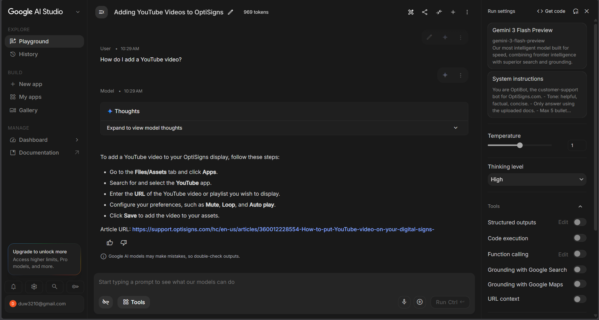

# OptiBot Mini-Clone – Support Article Sync

This project scrapes OptiSigns support articles, converts them to Markdown, and synchronizes new or updated articles to a Google Gemini File Search Store.

## Setup

1. Install dependencies:

```bash
pip install -r requirements.txt
```

2. Create a `.env` file:

```env
GEMINI_API_KEY=your_google_api_key
```

## Run Locally

```bash
python main.py
```

## Run with Docker

```bash
docker build -t optisigns-daily-sync .
docker run --rm --env-file .env optisigns-daily-sync
```

## Daily Job Logs

Deployment: **<GitHub Actions>**

Logs: **<Paste your job log URL here>**

## Assistant Sample

Question:

> How do I add a YouTube video?

Screenshot:


