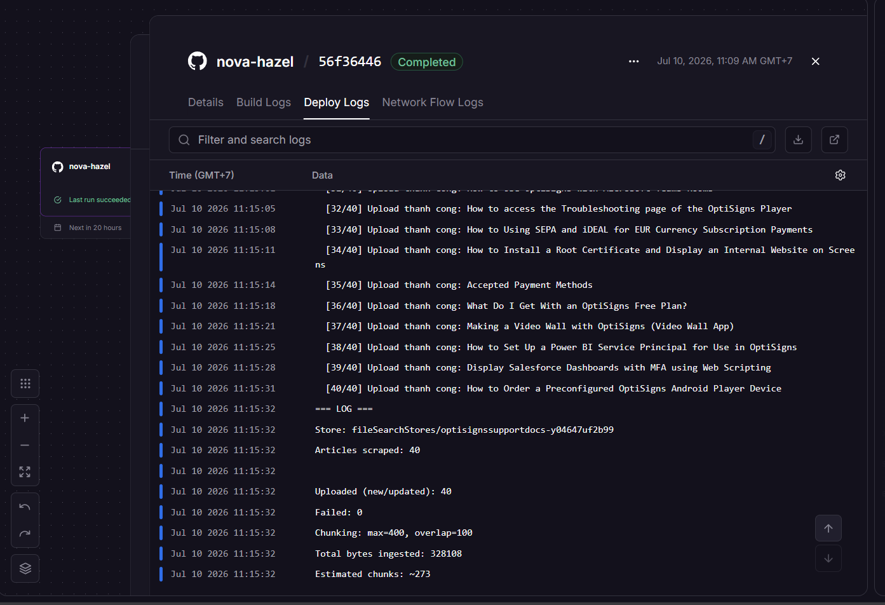
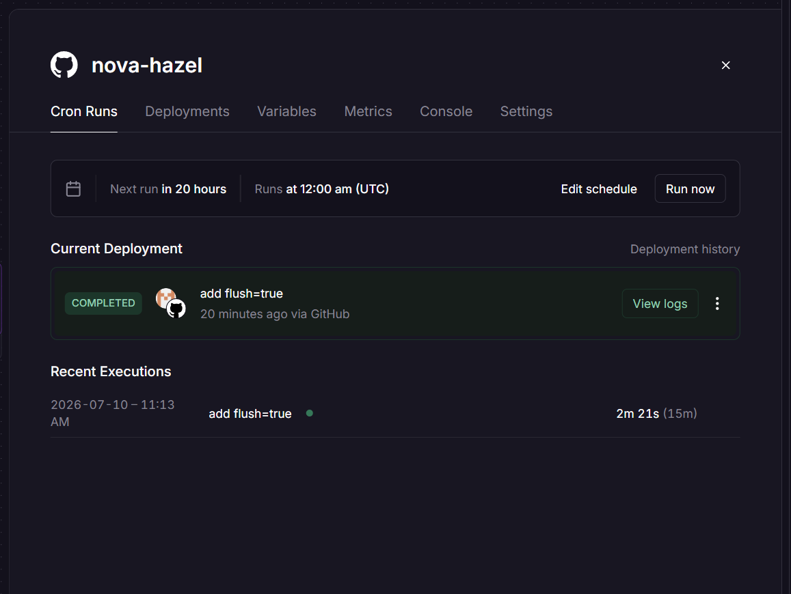

# OptiBot Mini-Clone – Support Article Sync

This project scrapes OptiSigns support articles, converts them to Markdown, and synchronizes new or updated articles to a Google Gemini File Search Store.

## Setup

1. Install dependencies:

```bash
pip install -r requirements.txt
```

2. Create a `.env` file:

```env
GEMINI_API_KEY=your_google_api_key

```

3. Chunking Strategy

Custom static chunking: `max_tokens_per_chunk=400`, `max_overlap_tokens=100`.

OptiSigns articles are short (~400–600 tokens avg) with tables/bullet lists. 400-token
chunks keep each chunk focused on one sub-topic instead of the whole article, improving
retrieval precision. 100-token overlap (25%) prevents context loss when a condition
sentence sits right before a new heading (e.g. "USD only" before "How to request a PO").

**Embedding log (last full run):**

- Articles scraped: 40
- Uploaded (new/updated): 40 (0 failed)
- Total bytes ingested: 328,108
- Estimated chunks: ~273 _(Gemini API doesn't expose exact chunk count — estimated as `bytes/4 ÷ (400-100)`)_

## Run Locally

```bash
python main.py
```

## Run with Docker

```bash
docker build -t optisigns-daily-sync .
docker run --rm --env-file .env optisigns-daily-sync
```

## Daily Job Logs

Deployment: **<Railway>**

Logs:


Schedule: 12am per day


## Assistant Sample

Question:

> How do I add a YouTube video?

Screenshot:


